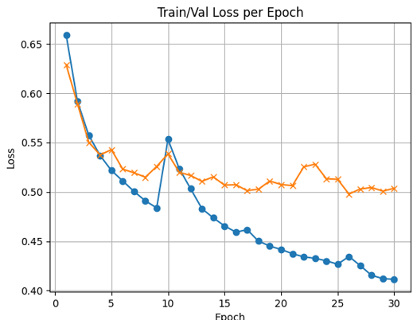

# 使用PPG信号建立预测血压信号波峰值（收缩压）和波谷值（舒张压）(PPG2BP)的机器学习模型
任务要求：  

• 使用留一交叉验证方法验证模型的性能，收缩压精度高于12 mmHg，舒张压精度高于8 mmHg（以Mean Absolute Error 计）；  

• 自行选择合理的源域进行预训练，剩余数据作为目标域进行个性化模型微调。

> data 预训练数据集
> > BP_data SBP和DBP各自在每个5s段内的均值
> > PPG_data 所有采集到的PPG信号
> 
> ft_data 模型微调数据集
> > > BP_data
> > PPG_data
>
> data_process.ipynb 数据预处理
> 
> train.ipynb 模型预训练
> 
> fine_tunning.ipynb 模型微调
> 
> pretrained_model_params1.pth 预训练模型权重
> 
## 1.数据预处理
数据集来源：https://archive.ics.uci.edu/dataset/340/cuff+less+blood+pressure+estimation
该数据集包含了若干matlab格式的.mat 文件，matlab文件中的每个cell是一个3𝑁大小的数组，该数组的第一列为PPG信号，第二列为血压信号，第三列为ECG信号。
### 1.1数据集划分
1. 给定数据集共有4个part，每个part包含3000个cells，每个cell可看做一段记录
2. 同一个病人可能有多段记录，具体数量不能确定，但对同一个病人，他的记录一定是相邻的
3. 采用part1-3作为预训练域，part4用作模型微调
4. 预训练采取80%训练集，20%验证集，并打乱顺序提高模型泛化能力（若不打乱顺序，模型的学习能力将会非常差，几乎不能学习到任何信息，预测结果是一条直线）
5. 模型微调时，针对单个病人，随选取1个cell，作为一段记录（可能包含2-100+个ppg_segments）,使用留一交叉验证法进行模型微调
### 1.2数据处理
1. 原始数据在125hz情况下采样得到，选取每625个ppg信号作为一个ppg_segment（5s）
2. 采用波峰波谷检测，计算每个ppg_segment中SBP和DBP均值，写入到csv文件中。
## 2.模型架构
模型架构参考论文《Personalized Blood Pressure Estimation Using Photoplethysmography: A Transfer Learning Approach》  

3层卷积 -> 残差连接 ->GRU -> 2层全连接层 -> 输出SBP/DBP  
具体架构图可在论文中找到
## 3.预训练
1. 采用先前的预训练数据集，以L1loss为损失函数，优化器选择adam，学习率设置为1e-3,
2. 训练30个epochs得到Train loss/Val loss曲线如下



loss收敛较慢，且模型似乎出现过拟合   
不过在最后一epoch验证集输出SBP/DBP预测MAE满足任务精度要求。
## 4.模型微调
1. 随机选取part4中的一个cell作为一个病人的一段记录，使用留一交叉验证法进行微调，训练5个epoch，输出SBP/DBP 的MAE。
2. 按照论文调整conv3,fc2以及bn层
3. 大部分记录SBP/DBP的预测精度满足要求，但也有部分记录微调后误差仍然很大。
4. 可以看到微调后模型MAE基本优于预训练模型
一个例子：
```
微调：
Mean SBP Error: 4.618418
Mean DBP Error: 1.654856

未经微调：
Mean SBP Error: 5.116440
Mean DBP Error: 1.918725
```
5. 可重复运行fine_tunning.ipynb,以得到对多个记录的结果用于对比。
